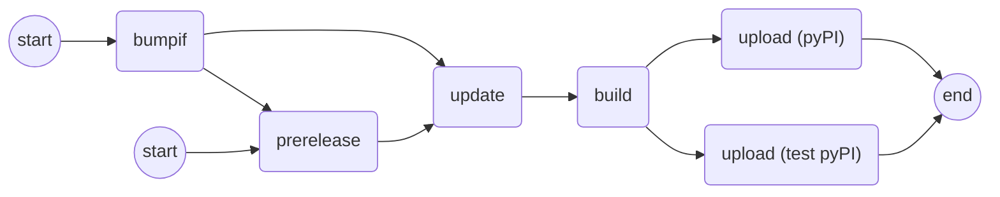

# Execution Flow

* `version.json`: contains a key-value (`<package_path>`: `<version>`) dictionary.
* `bumpif.sh`: bumps the minor version of a specific package version in `package.json` *only if* there are changes were found inside the package directory.
* `prerelease.sh`: appends (or removes) a pre-release tag from a specific package version in `package.json`.
* `update.sh`: updates version-related files inside the package directory using the package version in `package.json`.
* `build.sh`: cleans and builds a package directory.
* `upload.sh`: uploads a package to `test.pypi.org` (or `pypi.org`).

